

Travail Pratique 2

par

Nicolas PATENAUDE

DEVOIR PRÉSENTÉ À Loïc CYR

LOG725-01

MONTRÉAL, LE 7 DÉCEMBRE 2025

ÉCOLE DE TECHNOLOGIE SUPÉRIEURE

UNIVERSITÉ DU QUÉBEC

# Présentation

Pour ce travail, j'ai fait un réusinage du projet "Myriapod" que j'ai trouvé dans un des Repo GitHub recommandé dans l'énoncé du travail: <a href="https://github.com/Wireframe-Magazine/Code-the-Classics">https://github.com/Wireframe-Magazine/Code-the-Classics</a>.
Le travail est accèssible sur mon répertoire git (publique): <a href="https://github.com/taste3/LOG725-tp2">https://github.com/taste3/LOG725-tp2</a>. Dans ce jeu, on contrôle un petit robot et on tire sur des roches et sur un myriapode (mille-pattes) robotisé.

Les instructions pour lancer le jeu sont disponible dans le fichier README du projet et sont lisibles sur la page d'accueil de mon GitHub.

Afin de pouvoir appliquer les différents patrons, j'ai du commencer par séparer l'unique énorme fichier monolithe en différents fichiers qui représentent des modules séparés. Si le jeu était complètement refactoré avec le patron ECS, ces modules devraient être encore plus séparés en entités, composants et systèmes. Pour ce TP, seulement le module de <strong>projectiles (Bullet)</strong> à été refactoré avec le patron ECS.
Retiré le système de son du jeu de l'instance du jeu, la fonction qui permet de faire jouer un son utilise l'instance du jeu, mais n'est pas contenue dans cette instance. Pusiqu'elle n'avais pas besoin d'être couplée, je l'ai retiré pour simplicité et pour régler les quelque problèmes de dépendances circulaires que j'ai rencontrés. J'ai implémenté le patron <strong>Singleton sur la classe Game</strong> avec l'aide de la classe GameState afin de rendre accessible l'instance de jeu partout dans le code. J'ai choisi d'implémenter le patron <strong>Observer sur le système d'entrés du clavier</strong> parce que j'ai remarqué et moins aimé la manière dont la détection des touches fonctionnait.

# 1. Patron Singleton 

#### Relation avec le contexte du jeu

Au début, le jeu se trouvait dans un seul énorme fichier monolithe de plus de 900 lignes de code. Il y a bien sur plusieurs avantages à avoir tout en seul fichier, mais pour ce TP, il est impossible d'implémenter le patron ECS sans séparer le jeu en différent modules. Après avoir fait la séparation des différents modules du jeu en classes et fichiers séparés, je me suis rapidement rendu compte que l'utilisation de variables globales n'allaient pas fonctionner à travers les différents modules. La solution à laquelle j'ai immédiatement pensé est l'utilisation du patron <strong>Singleton</strong>. L'utilisation de ce patron est commune à plusieurs engins de jeux comme Unity. Ce patron permet de plus facilement gérer l'accès et la création de la classe qu'il concerne. 

#### Avantages et inconvénients
L'avantage principal de l'utilisation de ce patron est qu'il permet l'accès à la variable "game" dans tout les nouveaux modules créés après la refactorisation du fichier monolithe en plusieurs modules. Sans ce patron, il faudrait passer la variable "game" à tout les modules qui l'utilise et cela causerait beaucoup de problèmes de couplage. Un inconvénient de ce patron dans la situation de ce projet est qu'il ne peut pas être implémenté idéalement en raison du fort couplage de la classe Game avec tout les autres modules. Par exemple, la classe Game fait référence aux roches "Rock" et les roches font référence à la classe Game. Il est donc impossible sans revoir l'architecture du jeu dans son entièreté.

Voici comment fonctionnait l'accès à Game avant l'implémentation du patron:

#### Sans le patron Singleton

<em>Figure 1 : Une variable globale game est utilisée</em>

<em>Figure 2 : Le constructeur de game est appelé à plusieurs endroits</em>

Voici l'implémentation initiale que je voulais faire du patron. Cette implémentation est beaucoup plus proche du concept théorique du Singleton.

#### Implémentation idéale du patron Singleton

<em>Figure 3 : Implémentation idéale du patron Singleton</em>

Pour éviter de refactoriser le jeu en entier, j'ai implémenté la patron Singleton d'une manière différente. J'ai créé une classe à part nommée GameState qui contient l'instance de game. La nouvelle classe GameState contient aussi une méthode "statique" qui encapsule la création des nouvelles instances de Game. Partout dans les classes du jeu, on fait référence à GameState.game pour accéder au jeu. Il est à noter que la refactorisation complète du jeu en ECS éliminerais le besoin du Game et le besoin d'accéder à cette classe à partir de partout dans le code.

#### Avec le patron Singleton

<em>Figure 4 : Classe GameState</em>

<em>Figure 5 : Le script de démarrage du jeu utilise GameState au lieu de la variable globale</em>

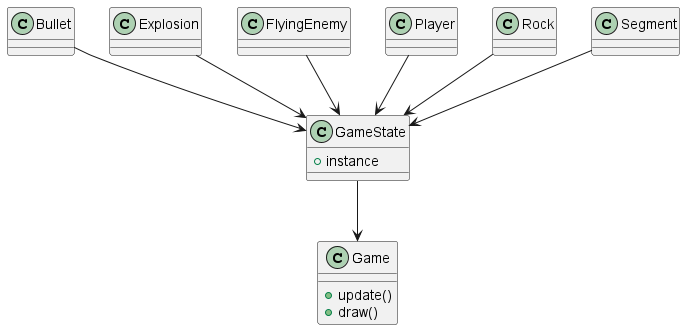

<em>Diagramme 1 : Diagramme du singleton pour Game</em>

# 2. Patron Observateur

#### Relation avec le contexte du jeu
Le package pgzero contient un module keyboard qui permet de très facilement accéder aux touches qui sont appuyés sur le clavier en temps réel. Par contre, il ne permet pas facilement de déterminer si une touche vient tout juste d'être appuyée. Une méthode à été créé pour cette ajouter cette fonctionalité demandée pour détecter si la barre d'espace viens d'être appuyée pour passer du menu principal au jeu. J'ai identifié que cette logique pourrait bénificier du patron Observateur.

#### Avantages et inconvénients
Un avantage clair est que cela viens uniformiser et simplifier le système d'entrée à travers tout le code. La simplification viens du fait que l'on s'abonne à un évennement à la place de devoir faire la vérificaiton manuelle à savoir si la touche est appuyée à toutes les updates. Un léger désavantage au niveau de la performance car on vérifie à toute les frames dans InputListener pour enregistrer toutes les touches pour savoir lesquelles viennent juste d'être appuyées. Cela simplifie le code mais coute un peu plus de performance. Je crois que l'utilisation du patron donne tout de même un net positif.

#### Sans le patron Observer

<em>Figure 6 : Méthode space_pressed</em>

J'ai donc généralisé cette méthode pour qu'elle fonctionne avec toutes les touches du clavier à travers tout le code. La nouvelle classe InputListener est le publisher et puisqu'elle est Singleton aussi, elle peut être utilisée de partout dans le code. 

#### Avec le patron Observer
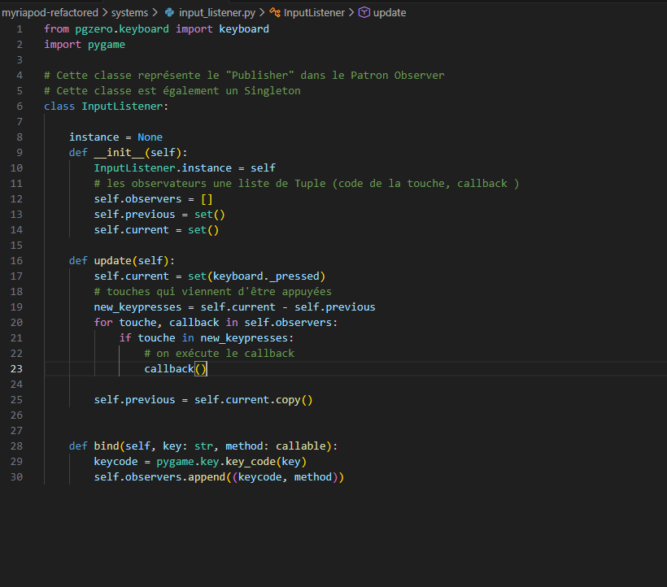

<em>Figure 7 : Classe InputListener (Publisher)</em>

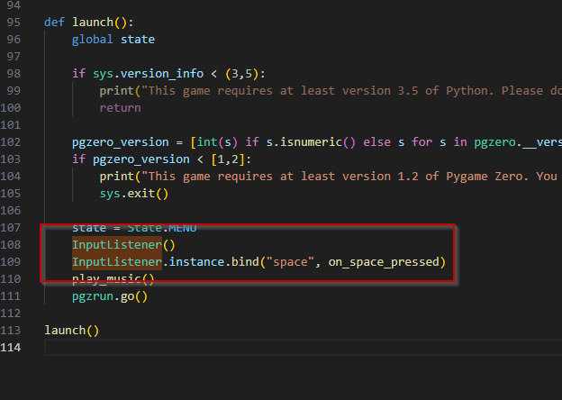

<em>Figure 8 : On abonne la méthode à la touche d'espace</em>

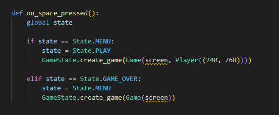

<em>Figure 9 : La nouvelle méthode fait en sorte qu'on change d'état immédiatement quand la touche d'espace est appuyée</em>

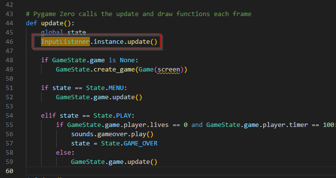

<em>Figure 10 : On met à jour le système de touches à toutes les update du jeu</em>

# 3. Patron Entity-Component-System

#### Relation avec le contexte du jeu
Dans le projet original, tout ce qui concernait les projectiles était géré directement dans la classe du joueur et dans la classe Game : création, mise à jour, affichage et suppression. J’ai choisi d’appliquer le patron ECS sur les projectiles. J'ai donc créé le dossier ECS dans lequel j'ai entity.py. J'ai créé les composants nécessaire pour Bullet et le système BulletSystem. L'entité sert seulement à associer les plusieurs composants ensemble. Le système permet de créer, mettre à jour et dessiner les balles. 
Pusique la position et d'autre parties de Bullet doivent être gardée pour pouvoir continuer de fonctionner avec la librairie pgzero, j'ai du créer un composant que l'on peut voir dans la Figure 12. Le composant ActorComponent est utilisé pour contenir la référence à l'acteur, l'objet qui permet de render et qui garde la position de la balle.

BulletSystem à été créé fortement inspiré de la classe initialle Bullet. Cette classe, qui héritait de Actor n'est plus utilisée. BulletSystem fait essentiellement le même travail, mais pour chacune des balles du jeu. BulletSystem est présenté dans la Figure 15. Les balles n'ont plus un lien d'héritage avec Actor, ils ont maintenant un lien composition à travers l'entité, comme le spécifie le patron.

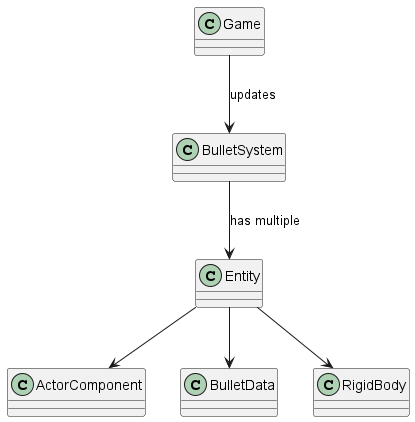

<em>Diagramme 2 : Diagramme du ECS pour la balle</em>

#### Avantages et inconvénients
Un avantage clair est que ce patron permet de réduire énormément la quantité de duplication de code à travers tout le projet. Cela permet de bien séparer les responsabilités de chacunes des parties du code. Le système est appelé dans Game.py afin de pouvoir lui demander de se mettre à jour et de redessiner les balles à toutes les frames du jeu.

#### Avec le patron ECS
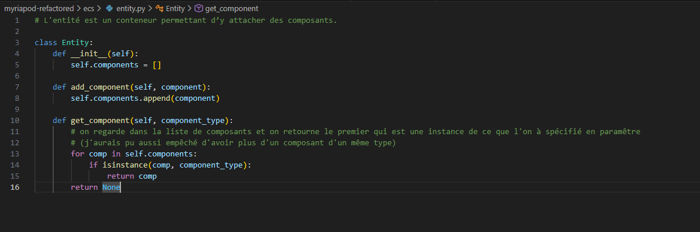

<em>Figure 11 : La classe Entité</em>

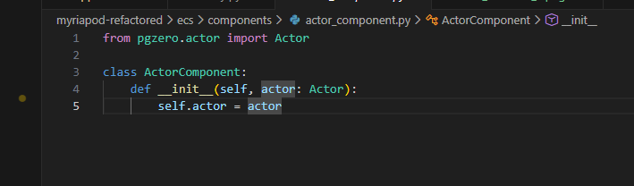

<em>Figure 12 : Le composant qui fait le lien avec l'acteur</em>

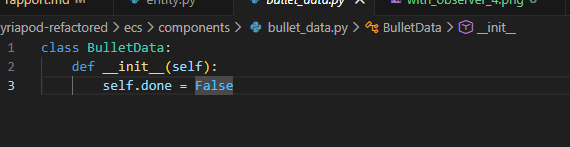

<em>Figure 13 : Le composant qui contient la seule variable de Bullet</em>

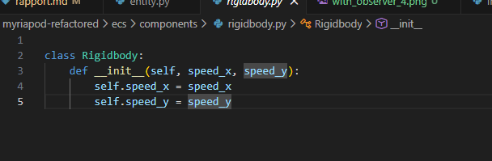

<em>Figure 14 : Le composant rigidbody qui contient la vitesse de la balle</em>

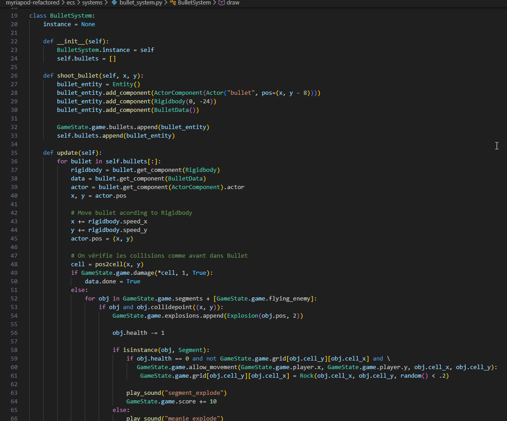

<em>Figure 15 : Le système BulletSystem</em>
