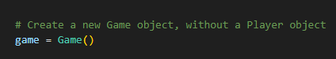
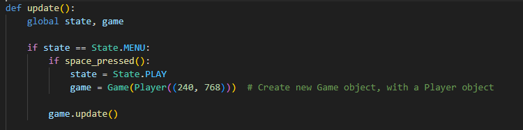
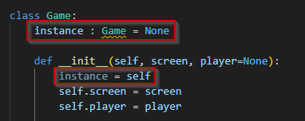
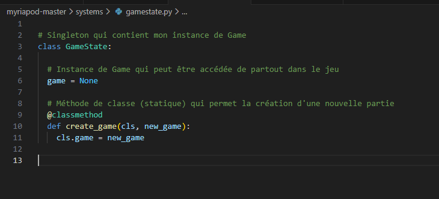

Travail Pratique 2

par

Nicolas PATENAUDE

DEVOIR PRÉSENTÉ À Loïc CYR

LOG725-01

MONTRÉAL, LE 7 DÉCEMBRE 2025

ÉCOLE DE TECHNOLOGIE SUPÉRIEURE

UNIVERSITÉ DU QUÉBEC

# Présentation

Pour ce travail, j'ai fait un réusinage du projet "Myriapod" que j'ai trouvé dans un des Repo GitHub recommandé dans l'énoncé du travail: <a href="https://github.com/Wireframe-Magazine/Code-the-Classics">https://github.com/Wireframe-Magazine/Code-the-Classics</a>.
Le travail est accèssible sur mon répertoire git (publique): <a href="https://github.com/taste3/LOG725-tp2">https://github.com/taste3/LOG725-tp2</a>. Dans ce jeu, on contrôle un petit robot et on tire sur des roches et sur un myriapode (mille-pattes) robotisé.

Les instructions pour lancer le jeu sont disponible dans le fichier README du projet et sont lisibles sur la page d'accueil de mon GitHub.

# Modifications

Afin de pouvoir appliquer les différents patrons, j'ai du commencer par séparer l'unique énorme fichier monolithe en différents fichiers qui représentent des modules séparés. Si le jeu était complètement refactoré avec le patron ECS, ces modules devraient être encore plus séparés en entités, composants et systèmes. Pour ce TP, seulement le module de """""""""""""""""""""""""""""""""""""""""""""""""""""""""""""""""""""""""""""""""""" à été refactoré avec le patron ECS.
Retiré le système de son du jeu de l'instance du jeu, la fonction qui permet de faire jouer un son utilise l'instance du jeu, mais n'est pas contenue dans cette instance.
Implémenté le patron Singleton sur la classe Game avec l'aide de la classe GameState afin de rendre accèssible l'instance de jeu partout dans le jeu.
Implémenté le patron Observer sur le système d'entrés du clavier
# 1. Patron Singleton 

#### Relation avec le contexte du jeu

Le jeu était tout en un seul énorme fichier monolithe de plus de 900 lignes de code. Il y a bien sur plusieurs avantages à avoir tout en seul fichier, mais pour ce TP, il est impossible d'implémenter le patron ECS sans séparer le jeu en différent modules. Après avoir fait la séparation des différents modules du jeu en classes et fichiers séparés, je me suis rapidement rendu compte que l'utilisation de variables globales n'allaient pas fonctionner dans un jeu séparé en plusieurs fichiers. La solution à laquelle j'ai immédiatement pensé est l'utilisation du patron <strong>Singleton</strong>. L'utilisation de ce patron est commune à plusieurs engins de jeux comme unity. Ce patron permet de facilement restreindre la création d'une nouvelle partie à seulement 

#### Avantages et inconvénients
L'avantage principal de l'utilisation de ce patron est qu'il permet de rendre l'accès à la variable "game" dans tout les nouveaux fichiers après la séparation des classes du fichier monolithe en plusieurs fichier. Sans ce patron, il faudrait passer la variable "game" à tout les composants qui l'utilise et cela causerait beaucoup de problème de couplage.

#### Sans le patron Singleton

<em>Figure 1 : Description</em>

<em>Figure 2 : Description</em>

Un inconvénient de l'utilisation de ce patron dans le contexte est qu'il y a tellement un fort couplage entre la classe Game et les autres classes que je ne peut pas mettre l'instance de la classe Game dans la classe elle même car cela causerais des références circulaires. Pour résoudre ces références circulaires, il faudrait implémenter ailleurs le patron Singleton et revoir l'architecture du jeu dans son entièreté. Idéalement, l'implémentation de ce patron ressemblerais à ceci: 

#### Implémentation idéale du patron Singleton

<em>Figure 3 : Implémentation idéale du patron Singleton</em>

Pour éviter de refactoriser le jeu en entier, j'ai implémenté la patron Singleton d'une manière différente. J'ai créé une classe à part nommée GameState qui contient l'instance:

#### Avec le patron Singleton

<em>Figure 4 : Description</em>

<em>Figure 5 : Description</em>

# 2. Patron Observateur

#### Relation avec le contexte du jeu
#### Avantages et inconvénients

#### Sans le patron Observer

<em>Figure X : Description</em>

#### Avec le patron Observer

<em>Figure X : Description</em>

# 3. Patron Entity-Component-System

#### Relation avec le contexte du jeu
#### Avantages et inconvénients

#### Sans le patron ECS

<em>Figure X : Description</em>

#### Avec le patron ECS

<em>Figure X : Description</em>

